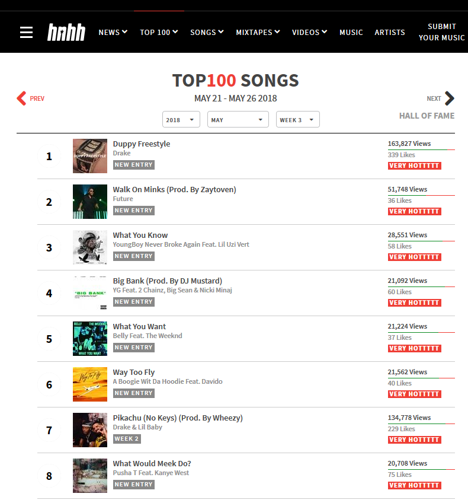

# Spotify-Playlist-Generator

Spotify Playlist Generator is a Python script that automatically builds a new Spotify playlist each week with new music.

### How it works
1. The script requests an __auth code__ using __clien id__ and __client secret__ which is then used to request the Spotify __access token__. This access token is then used for various POST and GET requests to the Spotify Web API.
2. When the script starts, it first checks the authority of its current __access token__.  Since this token expires after one hour, a new one will usually have to be generated.  The script uses its __refresh token__, which never changes, to acquire a new __access token__ from Spotify's token service. All of the tokens are stored in a Sqlite dabase (I've excluded the .db file).
3. Now that it has a valid access token, it proceeds to scrape the current top 100 songs from HotNewHipHop, located at this URL: https://www.hotnewhiphop.com/top100/

4. It parses through the page with the [Beautiful Soup 4](https://www.crummy.com/software/BeautifulSoup/bs4/doc/) library, building a list of "song candidates."  A song qualifies as a candidate if its artist list contains at least one artist in a `desiredArtists` list defined at the beginning of the script (a static list of artists who I like).
5. Then, for each song candidate, it ensures that the candidate is not a duplicate by querying the *songs_added* local db table for a song name and primary artist match.
6. Songs that are not duplicates are searched through Spotify's `/search` endpoint.  The Spotify `song ids` that are found (since these songs are new, many aren't on Spotify yet) are accumulated into a list.
7. Finally, all the songs from the list are added to the Spotify Playlist via a single POST request.

### Final Result

